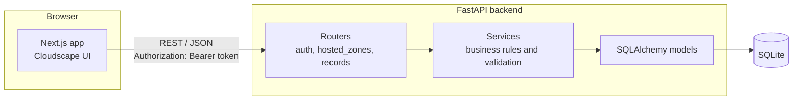
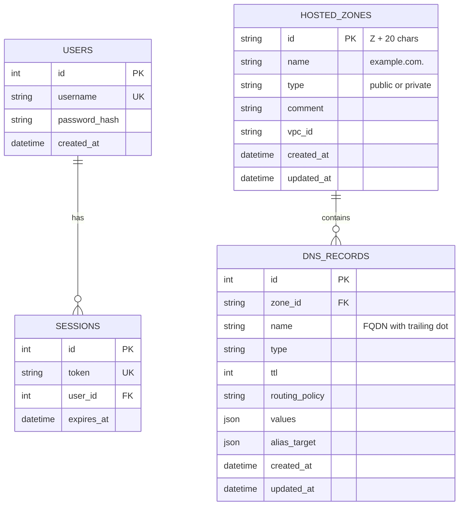

# Route 53 Console Clone

A functional clone of the **AWS Route 53 console**, built with **Next.js (TypeScript)**, **FastAPI** and **SQLite**. It recreates the Route 53 user experience (navigation, tables, filters, forms, modals, notifications) and its core workflows for **hosted zones** and **DNS records**. No real DNS is served: the focus is on the console experience, the API design and the data model.

> The UI is built with [Cloudscape Design System](https://cloudscape.design), the open-source library AWS itself uses for its console, so tables, property filters, flashbars, side navigation and forms look and behave like the real thing.

## Live demo

| | Link |
|---|---|
| **App** | https://route53-clone-rho.vercel.app |
| **API docs (Swagger)** | https://route53-clone-7zvh.onrender.com/api/docs |
| **Source** | https://github.com/Nishita-Kawadkar/route53-clone |

**Demo login:** `admin` / `admin123`

> **Note:** the backend runs on a free Render instance, which sleeps when idle. The first request after a quiet period can take 30 to 60 seconds. If sign-in seems slow, open the API docs link once to wake it up, then retry. Free hosting may also reset the SQLite file on redeploy, so demo data is not guaranteed to persist across deployments.

---

## Table of contents

1. [Features](#features)
2. [Tech stack](#tech-stack)
3. [Architecture overview](#architecture-overview)
4. [Project structure](#project-structure)
5. [Setup instructions](#setup-instructions)
6. [Database schema](#database-schema)
7. [API overview](#api-overview)
8. [Record validation rules](#record-validation-rules)
9. [Testing](#testing)
10. [Deployment](#deployment)
11. [Design decisions](#design-decisions)

---

## Features

### Authentication (mocked)
- Login and logout with a seeded demo user
- **Session persistence**: sessions are stored in the database and restored on page refresh
- Route guard: every console page redirects to `/login` without a valid session
- Expired or invalid sessions are handled globally and send the user back to login

### Hosted zones
- View hosted zones in a Route 53 style table with record count, type, description and ID
- **Search and filter** by property (name, description, ID, type) using Cloudscape's property filter, evaluated on the server
- Sorting, **server-side pagination** and a preferences dialog (page size, visible columns)
- Create public or private hosted zones (private zones require a VPC ID)
- Edit the description and delete zones with a **type-to-confirm** dialog
- Behaves like Route 53: new zones get default **NS and SOA** records automatically, and a zone can only be deleted once it holds no other records

### DNS records
- Records table inside a tabbed zone detail page (Records, DNSSEC, Query logging, Tags)
- Supports **A, AAAA, CNAME, TXT, MX, NS, PTR, SRV, CAA** (plus the default SOA)
- Debounced search, multi-select **type filter**, sorting and pagination
- One shared create/edit form that adapts to the record type, with per-type hints, a **live full-name preview** and inline plus server-side validation
- **Alias records** for A and AAAA
- **Bulk delete** with a report of anything that was skipped and why
- Default NS and SOA records are protected (checkbox disabled, name and type locked)

### Console experience
- AWS-style top bar, side navigation (Dashboard, Hosted zones, Health checks, Profiles, Traffic flow, Resolver), breadcrumbs, footer
- Flash notifications for success and error states
- "Coming soon" placeholder pages for the mocked sections

---

## Tech stack

| Layer | Technology |
|---|---|
| Frontend | Next.js (App Router), React, TypeScript, Cloudscape Design System |
| Backend | FastAPI, Pydantic v2, pydantic-settings |
| Database | SQLite via SQLAlchemy 2.0 |
| Auth | Server-side sessions with opaque bearer tokens (PBKDF2 password hashing, standard library only) |
| Tests | pytest, FastAPI TestClient, in-memory SQLite |
| Hosting | Vercel (frontend), Render (backend, Docker) |

---

## Architecture overview



### Request flow

1. The browser calls the REST API through a single typed fetch wrapper (`lib/api.ts`), which attaches the bearer token and turns FastAPI errors into readable messages.
2. A router validates the request shape with Pydantic schemas and resolves dependencies (current user, hosted zone).
3. A service applies the business rules: name normalisation, per-type value validation, conflict rules, default record protection.
4. SQLAlchemy persists the result to SQLite, and the service returns a response schema.

### Backend layering

| Layer | Responsibility | Location |
|---|---|---|
| **Routers** | HTTP concerns only: routes, status codes, query parameters, dependencies | `app/routers/` |
| **Services** | All business logic. Validators are small pure functions that are easy to unit test | `app/services/` |
| **Schemas** | Request and response models, input normalisation | `app/schemas.py` |
| **Models** | Table definitions, constraints, indexes | `app/models.py` |
| **Core** | Settings from environment variables, database engine, password hashing | `app/core/` |

### Frontend layering

| Layer | Responsibility | Location |
|---|---|---|
| **Pages** | Thin route components | `app/` |
| **Components** | Reusable pieces: records table, record form, delete and edit modals, console shell | `components/` |
| **lib** | API client, auth context, console context (notifications and breadcrumbs), typed models, per-type record hints | `lib/` |

Frontend engineering highlights:
- **Server-driven tables**: filtering, sorting and pagination happen in the API, with race-safe fetching (stale responses are ignored)
- **Debounced search** so typing does not fire a request per keystroke
- **One form component** serves both create and edit, driven by a data table of per-type hints instead of scattered conditionals
- Console state (flash messages, breadcrumbs) lives in a context, so any page can call `notify()` and set its own breadcrumbs

---

## Project structure

```
route53-clone/
├── README.md
├── backend/
│   ├── requirements.txt
│   ├── app/
│   │   ├── main.py              App factory, CORS, startup (table creation, demo user seeding)
│   │   ├── models.py            SQLAlchemy models
│   │   ├── schemas.py           Pydantic request/response schemas
│   │   ├── deps.py              Auth dependency (bearer token -> user)
│   │   ├── core/
│   │   │   ├── config.py        Settings (environment variables)
│   │   │   ├── database.py      Engine, session, SQLite foreign key pragma
│   │   │   └── security.py      PBKDF2 hashing, token generation
│   │   ├── routers/
│   │   │   ├── auth.py
│   │   │   ├── hosted_zones.py
│   │   │   └── records.py
│   │   └── services/
│   │       ├── zones.py         Zone rules, search, pagination
│   │       └── records.py       Record validation, conflict rules, bulk delete
│   └── tests/                   conftest, auth, zones and records tests
└── frontend/
    ├── app/
    │   ├── login/
    │   └── (console)/           Pages inside the console frame
    │       ├── hosted-zones/
    │       │   ├── create/
    │       │   └── [zoneId]/
    │       │       └── records/ new/ and [recordId]/edit/
    │       └── [section]/       "Coming soon" pages
    ├── components/              ConsoleShell, RecordsTable, RecordForm, modals
    └── lib/                     api, auth, console-context, hooks, types, nav, record-utils
```

---

## Setup instructions

### Prerequisites

- **Python 3.11+**
- **Node.js 18.18+** (check with `node -v`)
- Git

### 1. Clone the repository

```bash
git clone https://github.com/Nishita-Kawadkar/route53-clone.git
cd route53-clone
```

### 2. Run the backend

**Windows (PowerShell)**

```powershell
cd backend
python -m venv .venv
.venv\Scripts\activate
pip install -r requirements.txt
python -m uvicorn app.main:app --reload --port 8000
```

**macOS / Linux**

```bash
cd backend
python -m venv .venv
source .venv/bin/activate
pip install -r requirements.txt
python -m uvicorn app.main:app --reload --port 8000
```

On first start the app creates the SQLite database (`route53.db`) and seeds the demo user. Open http://localhost:8000/api/docs for the interactive Swagger UI.

### 3. Run the frontend

In a second terminal:

```bash
cd frontend
npm install
```

Create `frontend/.env.local`:

```
NEXT_PUBLIC_API_URL=http://localhost:8000/api
```

Then start the dev server:

```bash
npm run dev
```

Open http://localhost:3000 and sign in with `admin` / `admin123`.

> Always run `uvicorn` from inside `backend/`, otherwise Python cannot find the `app` package.

### Environment variables

**Backend** (all optional, with defaults)

| Variable | Default | Description |
|---|---|---|
| `DATABASE_URL` | `sqlite:///./route53.db` | SQLAlchemy database URL |
| `SESSION_TTL_HOURS` | `168` | Session lifetime (7 days) |
| `CORS_ORIGINS` | `["http://localhost:3000"]` | **JSON list** of allowed frontend origins |
| `DEMO_USERNAME` | `admin` | Seeded demo username |
| `DEMO_PASSWORD` | `admin123` | Seeded demo password |

> `CORS_ORIGINS` must be valid JSON, for example `["https://your-app.vercel.app"]`. A bare URL fails at startup.

**Frontend**

| Variable | Description |
|---|---|
| `NEXT_PUBLIC_API_URL` | Base URL of the API including `/api`. It is baked in at build time, so redeploy after changing it |

---

## Database schema

SQLite, managed with SQLAlchemy. Foreign keys are enabled with `PRAGMA foreign_keys=ON` on every connection so `ON DELETE CASCADE` works.



### Tables

**`users`**: `id`, `username` (unique), `password_hash` (`salt$PBKDF2-SHA256 digest`), `created_at`

**`sessions`**: `id`, `token` (unique, indexed), `user_id` → `users.id` (cascade), `expires_at`. Logout deletes the row, so logout is genuinely server-side.

**`hosted_zones`**: `id` (Route 53 style, `Z` + 20 uppercase alphanumerics), `name` (indexed, lowercase FQDN with trailing dot), `type`, `comment` (max 256), `vpc_id` (required for private zones), `created_at`, `updated_at`
- Unique constraint on **(`name`, `type`)**: a public and a private zone may share a name, as in Route 53

**`dns_records`**: `id`, `zone_id` → `hosted_zones.id` (**cascade delete**), `name`, `type`, `ttl`, `routing_policy` (`simple`), `values` (JSON array, one entry per value), `alias_target` (JSON, nullable), `created_at`, `updated_at`
- Unique constraint on **(`zone_id`, `name`, `type`)**: one record set per name and type, with multiple values stored in the `values` array, matching Route 53's model
- Composite index on **(`zone_id`, `type`)** to speed up the per-zone type filter

---

## API overview

Base path: `/api`. Everything except login and health requires `Authorization: Bearer <token>`. Full interactive documentation is available at `/api/docs`.

### Auth

| Method | Endpoint | Description |
|---|---|---|
| POST | `/auth/login` | Exchange username and password for a session token |
| POST | `/auth/logout` | Delete the current session |
| GET | `/auth/me` | Return the current user (used to restore a session) |

### Hosted zones

| Method | Endpoint | Description |
|---|---|---|
| GET | `/hosted-zones` | List with `search`, `name`, `comment`, `zone_id`, `type`, `sort`, `order`, `page`, `page_size` |
| POST | `/hosted-zones` | Create a zone (auto-creates NS and SOA records) |
| GET | `/hosted-zones/{zone_id}` | Get one zone with its record count |
| PATCH | `/hosted-zones/{zone_id}` | Edit the description |
| DELETE | `/hosted-zones/{zone_id}` | Delete (blocked while non-default records exist) |

### DNS records

| Method | Endpoint | Description |
|---|---|---|
| GET | `/hosted-zones/{zone_id}/records` | List with `search`, repeatable `type`, `sort`, `order`, `page`, `page_size` |
| POST | `/hosted-zones/{zone_id}/records` | Create a record |
| GET | `/hosted-zones/{zone_id}/records/{id}` | Get one record |
| PUT | `/hosted-zones/{zone_id}/records/{id}` | Replace a record |
| DELETE | `/hosted-zones/{zone_id}/records/{id}` | Delete a record |
| POST | `/hosted-zones/{zone_id}/records/bulk-delete` | Delete many; returns `deleted` and `skipped` with reasons |

### Misc

| Method | Endpoint | Description |
|---|---|---|
| GET | `/health` | Liveness check |

### Status codes

| Code | Meaning |
|---|---|
| 201 / 204 | Created / deleted |
| 401 | Missing, invalid or expired session |
| 404 | Zone or record not found |
| 409 | Conflict: duplicate zone or record, CNAME conflicts, deleting a non-empty zone, deleting default records |
| 422 | Validation error with a human-readable message |

### Example

```bash
# Log in
curl -X POST https://route53-clone-7zvh.onrender.com/api/auth/login \
  -H "Content-Type: application/json" \
  -d '{"username":"admin","password":"admin123"}'

# Create a record (replace <TOKEN> and <ZONE_ID>)
curl -X POST https://route53-clone-7zvh.onrender.com/api/hosted-zones/<ZONE_ID>/records \
  -H "Authorization: Bearer <TOKEN>" -H "Content-Type: application/json" \
  -d '{"name":"www","type":"A","ttl":300,"values":["192.0.2.10"]}'
```

---

## Record validation rules

Validation is enforced on the server (and mirrored with friendly messages in the form), implemented as small pure functions in `services/records.py`.

| Type | Rule |
|---|---|
| **A** | Valid IPv4 address per line |
| **AAAA** | Valid IPv6 address per line (normalised to compressed lowercase) |
| **CNAME** | Exactly one valid hostname |
| **MX** | `<priority> <mail server>`, priority 0 to 65535 |
| **NS** | One or more hostnames |
| **PTR** | Exactly one hostname |
| **SRV** | `<priority> <weight> <port> <target>` |
| **TXT** | Any text; automatically wrapped in quotes |
| **CAA** | `<flags> <tag> "<value>"`, tag one of `issue`, `issuewild`, `iodef` |

Behavioural rules, taken from Route 53:

- **Name normalisation**: `www`, `WWW` and `www.example.com.` all become `www.example.com.`; `@` or blank means the zone apex; names outside the zone are rejected
- One record per name and type; duplicate values are removed
- A **CNAME cannot coexist** with any other record at the same name and **cannot be created at the apex**
- **Alias records** are supported for A and AAAA only and cannot also carry values
- **SOA** cannot be created manually; the **default apex NS and SOA records cannot be deleted, renamed or retyped** (their values can be edited)
- Routing policy is limited to **simple** routing

---

## Testing

The backend has a pytest suite that runs against an isolated **in-memory SQLite** database, so tests never touch real data.

```bash
cd backend
pytest -q
```

Coverage includes login, logout and session expiry, the authentication guard, zone CRUD, duplicate and private-zone rules, search, property filters and pagination, record validation for every type, name normalisation, CNAME and alias rules, default record protection, bulk delete and the "cannot delete a non-empty zone" rule.

Frontend type checking and a production build:

```bash
cd frontend
npm run build
```

---

## Deployment

| Component | Platform | Notes |
|---|---|---|
| Frontend | **Vercel** | Root directory `frontend`. Set `NEXT_PUBLIC_API_URL` to `https://<backend-host>/api` and **redeploy** after any change |
| Backend | **Render** (Docker web service) | Root directory `backend`. Set `CORS_ORIGINS` to a JSON list containing the frontend URL |

Checklist when connecting the two:

1. Deploy the backend and confirm `https://<backend-host>/api/docs` loads
2. Set `NEXT_PUBLIC_API_URL=https://<backend-host>/api` on Vercel and redeploy
3. Set `CORS_ORIGINS=["https://<frontend-host>"]` on Render (valid JSON, no trailing slash)
4. Use the stable production domain, not a per-deployment preview URL, since only the configured origin is allowed

SQLite lives on the instance's local disk. On free tiers it can be wiped on redeploy or restart. For durable demo data, attach a persistent disk and point `DATABASE_URL` at it.

---

## Design decisions

- **Cloudscape instead of hand-built CSS.** It is the system the real console uses, which gives much closer visual and interaction fidelity than a custom design.
- **Server-side sessions instead of stateless JWTs.** Storing sessions in the database makes logout real (the token stops working immediately) and satisfies session persistence without extra libraries.
- **Standard-library password hashing (PBKDF2).** Avoids native build problems with bcrypt on hosting platforms.
- **Business rules in services, not routers.** Routers stay thin and the rules are testable without HTTP.
- **Record values stored as a JSON array.** One row per record set, as in Route 53, with the unique constraint on (zone, name, type) enforcing the model.
- **Names stored as fully qualified, lowercase, with a trailing dot.** The UI strips the dot for display; the API stays canonical.
- **Bulk delete reports instead of failing.** The response lists what was deleted and what was skipped (for example default records), so the UI can tell the user precisely.
- **Mocked scope kept honest.** Placeholder pages say they are not part of the clone, and routing policy is explicitly limited to simple routing.

---

## License

Built as an educational clone. AWS and Amazon Route 53 are trademarks of Amazon.com, Inc. or its affiliates; this project is not affiliated with or endorsed by AWS.
